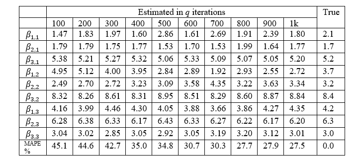
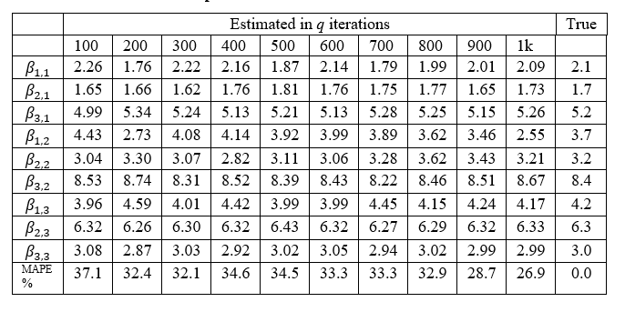
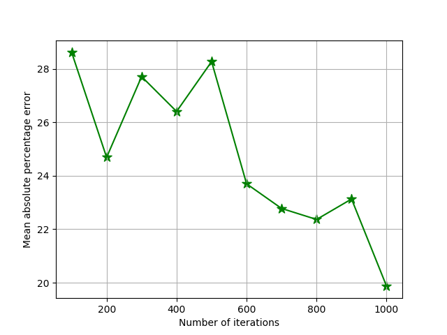
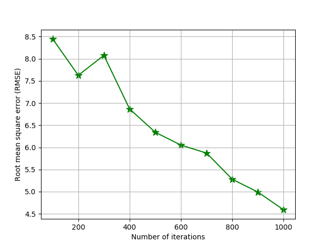
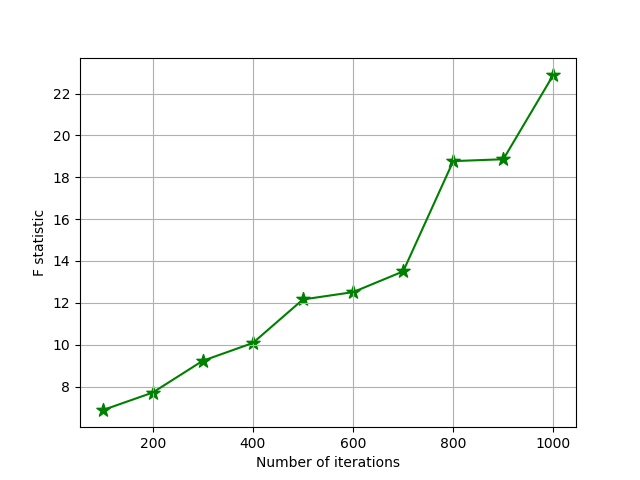
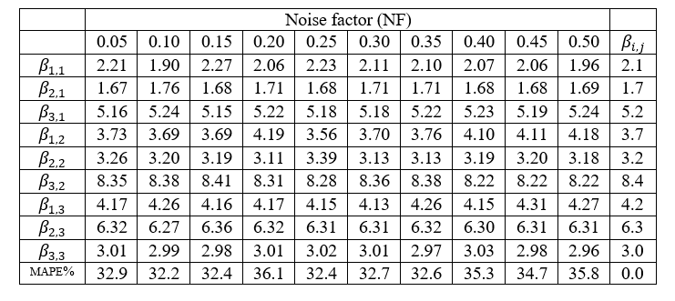

This work is funded by the post-doctoral research aid programme of the Republic of Latvia (No. 1.1.1.2/VIAA/1/16/075).

Markov-modulated linear regression (MMLR) was firstly proposed by professor Alexander Andronov. This model is a special case of the Markov additive process (Y, J), where component J is called Markov, and component Y is additive and described by a linear regression. The component J is a continuous-time homogeneous irreducible Markov chain with the known transition intensities between the states. Usually this Markov component is called the external environment or background process. Unknown regression coefficients depend on external environment state, but regressors remain constant.

Markov-switching regression models or regime switching regression models share the same idea of varying the regression parameters randomly in accordance with external environment. However, these models have significant differences in terms of the analytical approach.  Namely, MMLR describes the external environment as a continuous-time homogeneous irreducible Markov chain with known parameters. On the other hand, switching models consider Markov chain as unobservable and estimation procedure involves estimation of transition matrix.

The developed scripts can be applied to analyse statistical properties of MMLR model’s estimator based on simulated data. The examples below consider the influence of the sample parameters (e.g., sample size and distribution of the initial data), as well the influence of estimation method details (e.g., different weight matrices in OLS) on the consistency of model estimates. 

In case of the identity weight matrix, non-uniformity of observations is not taken into account, variance and its estimation is not required. 
The table demonstrates that even after thousand iterations, estimates of some coefficients are distinguished by relatively large deviations from the true parameters.

The case of the diagonal weight matrix, in which the diagonal elements are the inverse values of the variances of the dependent variable. Such a weight matrix is applied to minimize the variance of the estimates and to improve the convergence. In practical settings the unknown parameters β and variance are subject to estimation as well. However, this experiment assumes that their values are known, for example, obtained in a previous study. 

The figures below reflect changes of the determination coefficients for both cases. Since R2 naturally increases along with growing sample size, it cannot be fully reliable. In this regard, in order to verify the quality of the model, RMSE (Fig.2) and F-statistic (Fig.3) were also calculated. All three figures demonstrate the advantage 
of weight matrix with the inverse values of the response variable.

In the last experiment extra noise is inserted to the matrix of regressors. The results of the estimates are presented in Table 3 depending on the value of NF. 

References

[1] Alexander M. Andronov, Nadezda Spiridovska. Markov-Modulated Linear Regression. In proceedings’ book: International conference on Statistical Models and Methods for Reliability and Survival Analysis and Their Validation (S2MRSA), Bordeaux, France, pp.24–28., arXiv:1901.09600v1., 2012.

[2] Spiridovska, N.: A Quasi-Alternating Markov-Modulated Linear Regression: Model Implementation Using Data about Coaches’ Delay Time. International journal of circuits, systems and signal processing 12, 617–628, 2018.

[3] Irina Jackiva (Yatskiv), Nadezda Spiridovska. Data Preparation Framework Development for Markov-Modulated Linear Regression Analysis. In: Kabashkin I., Yatskiv I., Prentkovskis O. (eds) Reliability and Statistics in Transportation and Communication. RelStat 2018. Lecture Notes in Networks and Systems, Springer, Cham (Scopus) DOI: 10.1007/978-3-030-12450-2_17, 2019.

[4] Andronov, А. "Statistical estimation of parameters of Markov-modulated linear regression." In Статистические методы оценивания и проверки гипотез, pp. 163-180. 2012 (In Russian).
